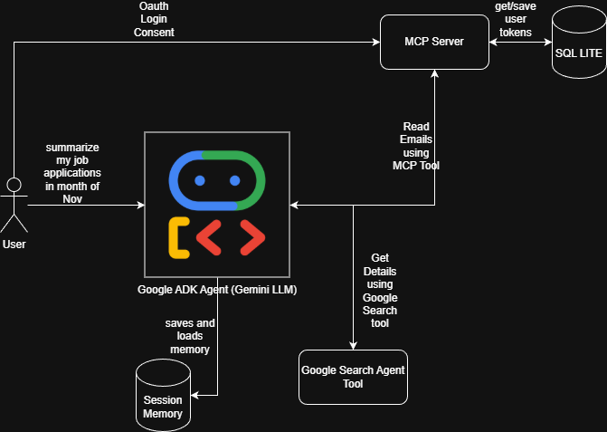

# google-adk-test
Creating Agents and MCP tools using Google ADK (Agent Development Kit)

# Agent
* It is a Helper agent that helps to memorize anything that I ask it to remember and then I can tally anything I cannot remember and want to know..
* Also, it can help to summarize anything using google search.

    * Example: Why applying for a job, I can it to give details on company overview, employee reviews, market rating etc.. and based on this.. I can decide to apply for that job.

    * Moreover I can ask it to remember that I applied for this job on some date lets say 21 Nov, and then later I can tally "What are all the jobs applied so far by me in Nov month."

* Agent also has a MCP tool that can help it to access user's GMAIL to get updated status on the job application.

    * Example: I can ask agent to get me the latest state for this job application based on my emails.

# MCP Server
* Built a custom MCP server that authenticates user based on OAUTH 2. It handles token refresh as well based on validating the current token being stored in local sqllite db.
* It user is not authenticated, the agent gives a login link where user has to manually go and give consent.
* Summarizes emails based on given date range and given label category.

# Memory
* Agent uses InMemoryMemoryService for testing locally.

# Tools
* Google search tool, which is inbuilt in adk that helps to search anything on google.
* tools exposed by MCP server as mentioned above. 

# Helper Agent Working Example 

* User can request any information to be searched in google. Agent uses google serach tool for this.
* Agent uses InMemoryMemoryService of google ADK to store and load memory to keep track of its context. Even if user uses a new session, the agent can lookup memory to lookup context from older conversations.
* Here I am using auto_save_to_memory callback, so that agent can autosave to memory after each conversation.
* If users asks to access emails, agent uses MCP server tools provided by given custom MCP server.
* The MCP server checks if the user does not have a valid token in the local sqllite db, it reqtuens a login url, which has be opened manually by user to given consent for gmail access.
* Once consent is given, user can re-ask the same question and Agent can get valid response accordingly from the MCP tools. 